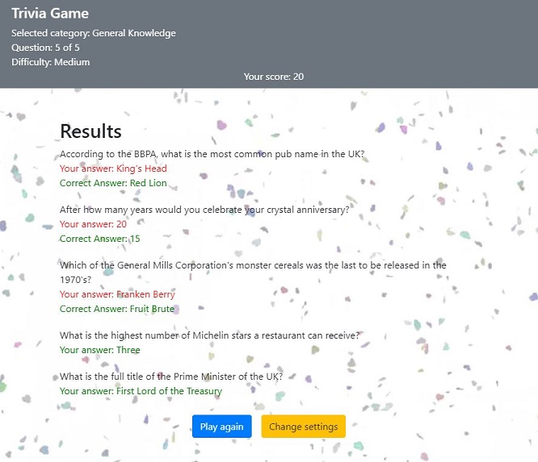

# Experis-TriviaGame-Vue
This is a Trivia game application built with Vue, bootstrap, html and css.

The questions for the game is provided by [The open trivia Database API.](https://opentdb.com/api_config.php)

## Startscreen

The game starts with selection of category, difficulty and amount of questions.


## Gamescreen

Instant visual feedback about the correctness of the players answer.


## Scorescreen




## Project setup
```
npm install
```

### Compiles and hot-reloads for development
```
npm run serve
```

### Compiles and minifies for production
```
npm run build
```

### Lints and fixes files
```
npm run lint
```

### Customize configuration
See [Configuration Reference](https://cli.vuejs.org/config/).


### Created By

[Eric Enooksson](https://github.com/Bumpfel/), [Emil Oja](https://github.com/xtrmil)
